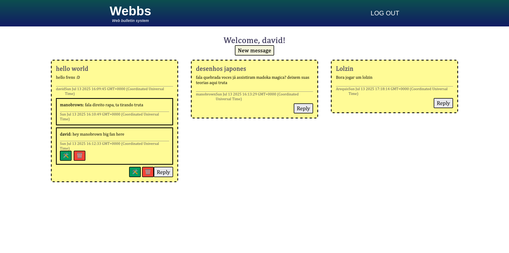

# Webbs

Webbs is a web application for sharing messages. Inspired by the classic [BBS](https://en.wikipedia.org/wiki/Bulletin_board_system).



## Features

- User authentication with Passport.js
- Post public messages
- Reply to other users messages (threaded)
- Edit and delete your own messages
- Route protection (only message owners can edit or delete)

## How to launch it

1. Clone the repository:
   ```bash
   git clone git@github.com:davideaded/webbs.git
   cd webbs
   ```
2. Install dependencies
    ```bash
    npm install
    ```
3. Set up postgresql DB and connect to it
4. Run app.js
